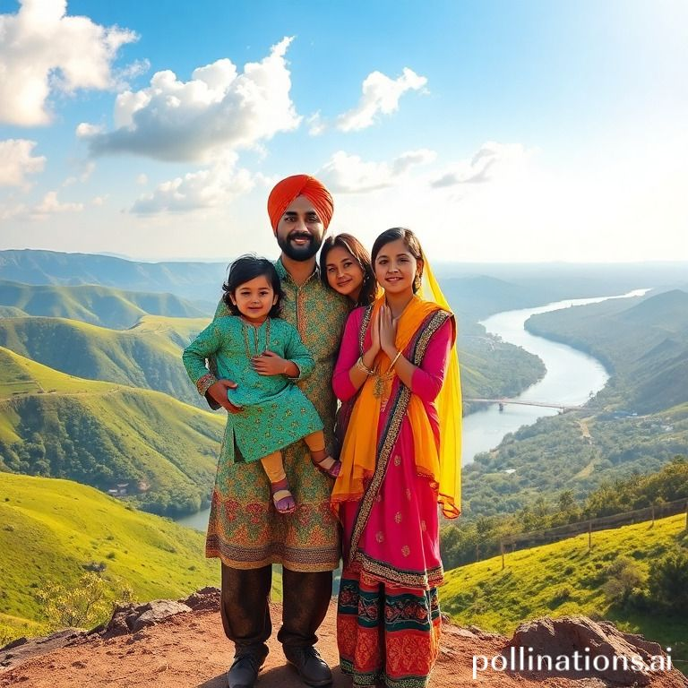

# winzy-text-to-image

[](https://pypi.org/project/winzy-text-to-image/)
[](https://github.com/sukhbinder/winzy-text-to-image/releases)
[](https://github.com/sukhbinder/winzy-text-to-image/actions?query=workflow%3ATest)
[](https://github.com/sukhbinder/winzy-text-to-image/blob/main/LICENSE)

Generate text to image using pollinations.ai api

## Installation

First configure your Winzy project [to use Winzy](https://github.com/sukhbinder/winzy).

Then install this plugin in the same environment as your Winzy application.
```bash
pip install winzy-text-to-image
```
## Usage

To create an image, use it like this.

```bash
winzy txt2img -p a punjabi family of four overloking a valley 
```
This produces this image.




## Development

To set up this plugin locally, first checkout the code. Then create a new virtual environment:
```bash
cd winzy-text-to-image
python -m venv venv
source venv/bin/activate
```
Now install the dependencies and test dependencies:
```bash
pip install -e '.[test]'
```
To run the tests:
```bash
python -m pytest
```
